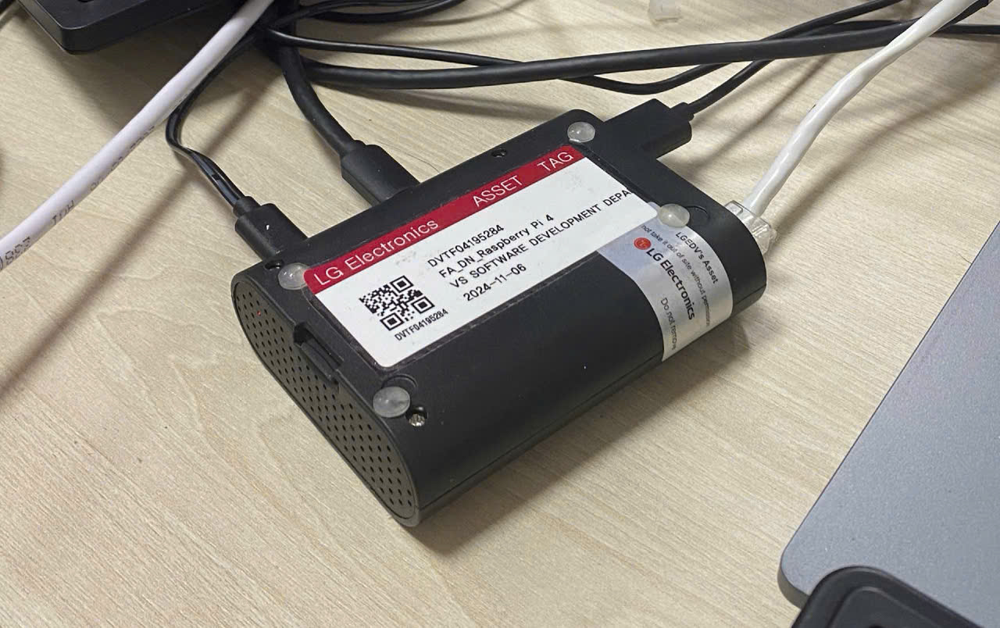
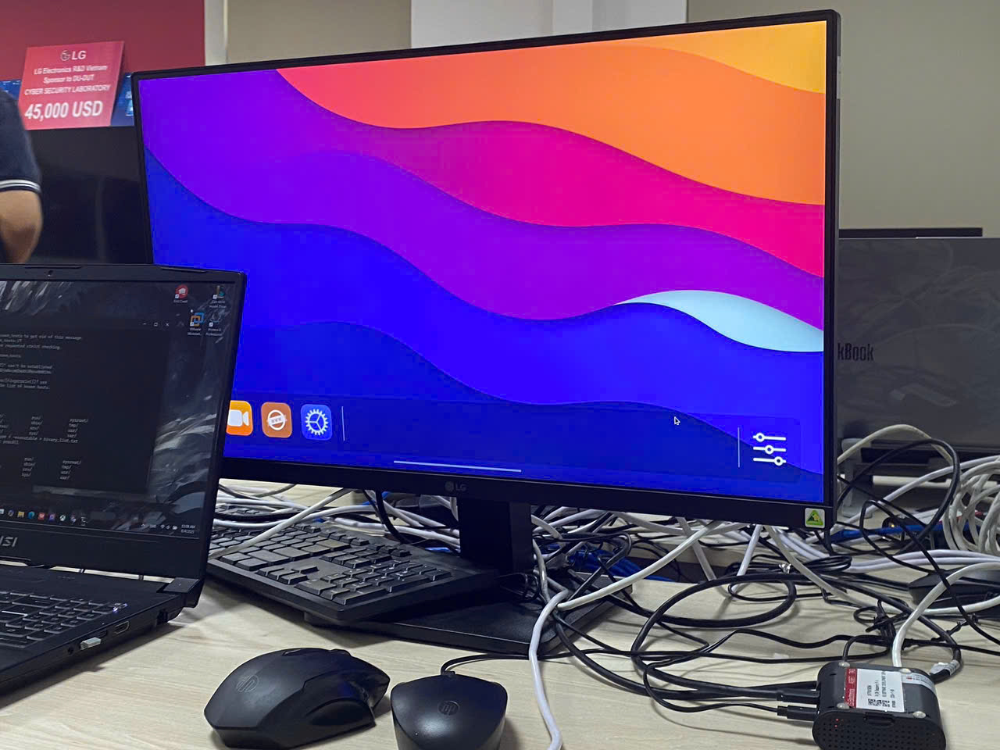

# Secure Firewall & OS Hardening on Raspberry Pi (webOS OSE 2.20)
<p align="center">
<a href="https://fb.com/duytan.hh" target="_blank"></a>
<a href="https://t.me/duytan2003" target="_blank"></a>
<a href="https://www.linkedin.com/in/l%C3%AA-tr%E1%BA%A7n-duy-t%C3%A2n-81112a23a/" target="_blank"></a>
</p>

## Overview

This project is developed based on publicly shared resources from **LG Electronics R&D Vietnam – Da Nang branch**, serving training and research activities at the **LG Lab**.

It focuses on building a **custom WebOS** embedded on **Raspberry Pi 4**, integrating key Linux security features to enhance embedded system security — especially for **automotive** and **edge devices**.

### **Main Project Components**

####  **1. Firewall Development and Integration**

* Setup WebOS environment, GitLab repository, and kernel configurations
* Implement firewall features:

  * IP/Port blocking, whitelist management
  * Protection against DDoS, SYN flood, ICMP flood
  * Logging, traffic analysis, and rule customization
* Perform integration testing on Raspberry Pi

#### **2. SMACK Security Implementation**

* Research and port SMACK (Security Module) to WebOS
* Flash and configure SMACK in permissive/enforcing modes
* Label system files and set security rules
* Integrate with other features like Firewall, EV, and Music Player

#### **3. Security Testing and Test Case Design**

* Design detailed test cases based on predefined scenarios (STC1 – STC7)
* Develop additional test cases based on understanding of SMACK/Firewall
* Execute tests using tools like **Wireshark** and **Scapy**

#### **4. Open Source Software Vulnerability Scan (OSSVS)**

* Study **supply chain attacks** and tools:

  * **Dependency-Check**
  * **Fosslight-Yocto**
* Generate CVE reports, triage vulnerabilities, apply patches
* Create intermediate and final security reports

#### **5. Memory Exploitation Protection (EM)**

* Explore memory exploits (buffer overflow, shellcode, etc.)
* Assess protection mechanisms: RELRO, NX, PIE, Canary, Fortify Source
* Scan binaries using `checksec.sh`, adjust GCC compile flags to enhance security

#### **6. OS Hardening (OSH)**

* Customize OS hardening checklist based on RHEL for Raspberry Pi
* Write and execute OSH scripts
* Identify and resolve security issues in system configuration


---
# Build webOS OSE on Raspberry Pi 4

### Related Documentation

* [Building webOS OSE Guide](https://www.webosose.org/docs/guides/setup/building-webos-ose/)
* [Flashing webOS OSE Guide](https://www.webosose.org/docs/guides/setup/flashing-webos-ose/)

## I. PREREQUISITES

### 1. Required Knowledge

* Basic networking concepts
* Linux command line
* Understanding of kernel modules, SMACK

### 2. Hardware

* Raspberry Pi 4 (8GB RAM recommended)
* SD card flashed with webOS OSE

### 3. Software Tools

```bash
sudo apt install build-essential cmake git curl autoconf automake bison flex gawk libtool pkg-config docker.io git-all
```

### 4. Initial Setup

* Ensure SSH access to Raspberry Pi


## II. CONFIGURATIONS

### 1. Build Environment

#### Step 1: Update system and install dependencies

```bash
sudo apt update && sudo apt upgrade -y
sudo apt install build-essential cmake git curl
sudo apt install autoconf automake bison flex gawk libtool pkg-config
sudo apt install git-all docker.io
sudo systemctl enable docker && sudo systemctl start docker
sudo usermod -aG docker $USER
```

#### Step 2: Clone & configure build system

```bash
git clone https://github.com/webosose/build-webos.git
cd build-webos
git checkout 2.20
sudo scripts/prerequisites.sh
./mcf -p 3 -b 3 raspberrypi4-64
```

#### Step 3: Kernel and Security Configurations

Modify the following files to enable SMACK and necessary kernel modules:

**File 1: `meta-webosose/meta-webos-raspberrypi/recipes-kernel/linux/linux-raspberrypi/bridge.cfg`**

```plaintext
CONFIG_NETFILTER_XT_MATCH_CONNBYTES=y
CONFIG_NETFILTER_XT_MATCH_CONNLIMIT=y
CONFIG_NETFILTER_XT_MATCH_IPRANGE=y
CONFIG_NETFILTER_XT_MATCH_LENGTH=y
CONFIG_NETFILTER_XT_MATCH_LIMIT=y
CONFIG_NETFILTER_XT_MATCH_MAC=y
CONFIG_NETFILTER_XT_MATCH_QUOTA=y
CONFIG_NETFILTER_XT_TARGET_NFLOG=y
CONFIG_NF_LOG_IPV4=y
CONFIG_NETFILTER_XT_MATCH_RECENT=y
CONFIG_NETFILTER_XT_MATCH_TCPMSS=y
CONFIG_NETFILTER_XT_TARGET_TCPMSS=y
CONFIG_NETFILTER_XT_MATCH_HASHLIMIT=y
CONFIG_NETFILTER_XT_MATCH_NFACCT=y
CONFIG_IP_SET=y
CONFIG_IP_SET_HASH_IP=y
CONFIG_IP_SET_HASH_NET=y
CONFIG_NETFILTER_XT_SET=y
```

**File 2: `meta-webosose/meta-webos-raspberrypi/recipes-kernel/linux/linux-raspberrypi/security.cfg`**

```plaintext
CONFIG_SECURITY_SMACK=y
CONFIG_DEFAULT_SECURITY="smack"
CONFIG_DEFAULT_SECURITY_SMACK=y
CONFIG_TMPFS_XATTR=y
CONFIG_SECURITY_SMACK_BRINGUP=y
CONFIG_LSM="lockdown,yama,loadpin,safesetid,integrity,smack,selinux,tomoyo,apparmor"
CONFIG_IKCONFIG_PROC=y
CONFIG_IKCONFIG=y
CONFIG_PROC_FS=y
CONFIG_EXPERT=y
```

**File 3: `meta-webosose/meta-webos/recipes-core/images/webos-image.bb`**
Append:

```plaintext
WEBOS_IMAGE_EXTRA_INSTALL:append = " htop tcpdump ipset apt kernel-module-xt-hashlimit "
```

**File 4: `conf/local.conf`**
Append:

```plaintext
DISTRO_FEATURES:append = " smack"
DISTRO_FEATURES:append = " smack-bringup"
```

#### Step 4: Build image

```bash
source oe-init-build-env
bitbake webos-image
```

#### Step 5: Extract image and flash SD card

```bash
cd BUILD/deploy/images/raspberrypi4-64
bunzip2 webos-image-raspberrypi4-64.rootfs.wic.bz2
lsblk
sudo umount /dev/sdX1
sudo dd bs=4M if=webos-image-raspberrypi4-64.rootfs.wic of=/dev/sdX status=progress
sudo umount /dev/sdX
```

#### The Raspberry Pi 4 is connected to a power source, a LAN network, and a mini HDMI cable connected to a monitor



---

## III. PROBLEMS & SOLUTIONS

### 1. Qtbase build error (RAM limitation)

```bash
sudo fallocate -l 20G /swapfile
sudo chmod 600 /swapfile
sudo mkswap /swapfile
sudo swapon /swapfile
```

### 2. aktualizr do\_fetch failure

* Update `GARAGE_SIGN_PV` variable
* Replace old checksum lines in `SRC_URI[]`


## IV. TESTING

Once image is flashed and running on Raspberry Pi:

* Check SMACK policies using: `cat /proc/self/attr/current`
* Verify included utilities: `htop`, `tcpdump`, etc.
* Confirm SMACK kernel support using: `dmesg | grep smack`

## V. APPENDIX

Useful commands:

* `bitbake -c cleanall webos-image` — clean build
* `docker ps`, `docker system prune` — manage build containers
* `oe-init-build-env` — reenter build environment

---
# Raspberry Pi Firewall for webOS OSE
### Related Documentation

* [ebtables/iptables interaction on a Linux-based bridge](https://ebtables.netfilter.org/br_fw_ia/br_fw_ia.html)
* [Linux Iptables Pocket Reference](https://linuxbg.eu/books/Linux%20Iptables%20Pocket%20Reference.pdf)
* [A Deep Dive into Iptables and Netfilter Architecture](https://www.digitalocean.com/community/tutorials/a-deep-dive-into-iptables-and-netfilter-architecture#the-filter-table)
* [nftables](https://wiki.archlinux.org/title/Nftables)
## I. Features

The firewall defends against:

| Attack Type       | Description |
|------------------|-------------|
| **Port Scanning** | Detects excessive RST packets and drops scan attempts |
| **Stealth Scan**  | Drops malformed TCP packets (NULL, XMAS, FIN, etc.) |
| **SYN Flood**     | Limits new TCP connections and validates handshake |
| **IP Spoofing**   | Blocks traffic from reserved/bogon IP ranges |
| **LAND Attack**   | Drops packets with identical source and destination IP |
| **Smurf Attack**  | Blocks all ICMP traffic to prevent amplification attacks |


##  II. Rule Overview 

###  Blacklist IP Set

```nft
table ip mangle {
  set blacklist {
    type ipv4_addr;
    elements = { 10.0.0.0/12, ..., 255.255.255.255 }
  }
````

### PREROUTING Chain (Anti-spoofing + Stealth + Smurf)

```nft
ct state invalid drop
tcp flags != syn / fin,syn,rst,ack ct state new drop
ct state new tcp option maxseg size != 536-65535 drop
tcp flags ! fin,syn,rst,psh,ack,urg drop
...
ip saddr != 192.168.88.252 ip saddr @blacklist drop
ip saddr 192.168.88.252 ip daddr 192.168.88.252 drop
ip protocol icmp drop
```

* Blocks invalid packets and malformed TCP flags
* Drops spoofed packets using a fast hash-based IP set
* LAND attack protection
* Drops all ICMP traffic to prevent Smurf attacks


###  Port-Scanning Chain

```nft
chain port-scanning {
  tcp flags rst / fin,syn,rst,ack limit rate 1/second burst 2 return
  drop
}
```

→ Drops suspicious RST floods often seen in scanning.

###  INPUT Chain (SYN Flood & SSH Protection)

```nft
ip saddr 192.168.88.252 tcp dport 22 accept
ct state established,related accept
tcp flags & rst == rst limit rate 2/second burst 2 accept
tcp flags & rst == rst drop
ip protocol tcp ct state new meter tcp_new_conn size 65535 {
  ip saddr limit rate over 60/second burst 20
} drop
```

* Allows SSH only from trusted IP `192.168.88.252`
* Throttles RST packets
* SYN flood protection via connection rate limiting

---

## III. Deployment Instructions

1. Copy `rules.conf` to your device:

   ```bash
   sudo cp rules.conf /etc/nftables/
   ```
2. Apply the firewall rules:

   ```bash
   sudo nft -f /etc/nftables/rules.conf
   ```
3. Enable nftables on startup:

   ```bash
   sudo systemctl enable nftables
   ```
---
# Scapy Attack Test Framework for Raspberry Pi (webOS OSE)

##  I. Objective

Simulate packet injection attacks:
- Spoofed MAC address
- Modified VLAN ID (802.1Q)
- Fake IPv6 address
- Embedded shell commands in TCP payloads

Observe whether Raspberry Pi:
- Executes the payload
- Changes its configuration (IP, MAC, VLAN)
- Can filter or reject malicious packets

##  II. Components

### Receiver: `listener.py` (on Raspberry Pi)

- **Listens on**: `eth0` interface
- **Packet filtering**: Accepts packets only from trusted MACs (editable)
- **Payload parsing**: Accepts 3 types:
  - `IPV6=<address>`
  - `MAC=<new_mac>`
  - `VLAN=<vlan_id>`
- **Action**: Executes the change using system commands

### Sender: `N16_1_15_2.py` + `md_fw_declare.py` (on Windows)

- Uses **Scapy** to craft and send packets
- Payload is embedded in a TCP over IPv6 over VLAN packet
- Sends packets with spoofed MAC, VLAN 5, and target IPv6

### CLI Menu (`md_fw_menu.py`)
```

----------------------- MENU ----------------------
1\. \[Infor] Packet information
2\. \[Send]  Packet Send
0\. \[Exit]  Exit
---------------------------------------------------

````

## III. Example Payloads

Payloads sent in TCP body:
```python
"IPV6=fd53:1234:5678:5::99"
"MAC=00:11:22:33:44:55"
"VLAN=10"
````

Advanced payload to inject shell commands:

```python
"sh:ip link add link eth0 name eth0.5 type vlan id 5 && ip link set dev eth0.5 address AA:BB:CC:DD:EE:FF && ip link set dev eth0.5 up"
```

##  IV. Key Findings 

* Scapy can bypass firewalls that operate at Layer 3–4 (IP/Port) because:

  * It injects packets directly at Layer 2 (Ethernet)
  * Listener captures packets **before** firewall applies filtering
* Even when packet is blocked at network layer, **payload may still reach user-space apps** if interface is in **promiscuous mode**


## V. Suggested Defenses (application-layer)

* Disable **promiscuous mode** on network interface
* Validate payload content before execution
* Use **AppArmor** to sandbox Python
* Monitor for dangerous patterns like `sh:`, `rm -rf`, `wget`
* Run receivers with **no shell access / limited subprocess permissions**

---

# Raspberry Pi Network Testing with IPv4 & IPv6

## I. Hardware & Software Setup

###  Hardware:
- 3 Raspberry Pi 4
- 1 Switch
- Ethernet cables
- Power supplies
- Monitor via mini-HDMI (for debug)

### Software Tools:
- Python 3 with socket module
- Linux CLI tools: `ip`, `ifconfig`, `ping`, `ping6`, `tcpdump`
- Multicast tools: `ip maddr`, `sysctl`
- For Anycast: **FRRouting (FRR)** with BGP/OSPF (optional)

## II. Device Setup

### IPv4 Addressing:
```bash
# Device 1 (sender)
ip addr add 10.10.16.48/24 dev eth0

# Device 2
sysctl net.ipv4.icmp_echo_ignore_broadcasts=0
ip addr add 10.10.16.108/24 dev eth0

# Device 3
sysctl net.ipv4.icmp_echo_ignore_broadcasts=0
ip addr add 10.10.16.92/24 dev eth0
````

### IPv6 Addressing:

```bash
# Sender (Raspberry Pi 1)
ip -6 addr add fd00::1/64 dev eth0

# Receivers (Pi 2 & Pi 3) with Anycast
ip -6 addr add fd00::100/128 dev eth0 nodad
```

## III. Testing Procedures

### IPv4 Multicast

* **Sender**: sends `b"robot"` to group `224.1.1.1`
* **Receiver**: joins multicast group and listens via `receive1.py`
* Outcome: Only group members receive the message

### IPv4 Unicast

* **Sender**: sends `b"test unicastv4"` directly to receiver IP
* **Receiver**: listens on UDP port 5007

### IPv4 Broadcast

* **Sender**: sends to broadcast address (`10.10.16.255`)
* **Receivers**: configured to accept and respond


### IPv6 Multicast

* **Sender**: sends to `ff04::111` on UDP port 10000
* **Receivers**:

  * `Receiver1` listens on `ff04::123` → ❌ no receive
  * `Receiver2` listens on `ff04::111` → ✅ successful receive

### IPv6 Unicast

* **Sender**: sends to `fd53:1234:5678:5::39`
* **Receiver**: listens on all interfaces, UDP port 10000

### IPv6 Anycast

* All receivers share address `fd00::100`
* Packet delivered to **nearest available device**
* When one Pi shuts down → traffic shifts automatically to the other


## IV. Performance & Security Evaluation

| Transmission | Model       | Pros                         | Cons                          | Performance |
| ------------ | ----------- | ---------------------------- | ----------------------------- | ----------- |
| Unicast      | 1 → 1       | Simple, secure               | Not scalable                  | High        |
| Broadcast    | 1 → all     | Easy in LAN                  | Bandwidth waste, low security | Low         |
| Multicast    | 1 → group   | Efficient group delivery     | Complex setup, sniffable      | High        |
| Anycast      | 1 → nearest | Fast, fault-tolerant routing | Needs BGP, harder to test     | Very High   |

---

# ULOGD2 Packet Logging System on Raspberry Pi 

## I. Required Tools

| Component         | Description                                |
|------------------|--------------------------------------------|
| ulogd2           | Netfilter user-space logging daemon        |
| iptables         | Used only to redirect packets to NFLOG     |
| libjansson       | Enables JSON output in ulogd2              |
| tcpdump          | Used to debug incoming packets             |
| logrotate        | Manages log rotation                       |

## II. Architecture Overview

### Packet Flow

```
\[ Network Packet ]
↓
iptables rule:
-j NFLOG
↓
\[ ulogd2: Input Plugin (NFLOG) ]
↓
\[ Filters: BASE, IP2STR, PRINTPKT ]
↓
\[ Output: JSON or LOGEMU ]
↓
/var/log/firewall\_log.json

````

## III. System Setup

### Platform
- Raspberry Pi 4
- Ethernet-connected (eth0)
- WebOS OSE (based on Yocto)


## IV. ulogd2 Configuration

### Install Dependencies
```bash
sudo apt install ulogd2 iptables libjansson4
````

### ulogd.conf File (`/etc/ulogd.conf`)

```ini
[global]
logfile="/var/log/ulogd.log"
loglevel=3

plugin="/usr/lib/ulogd/ulogd_inppkt_NFLOG.so"
plugin="/usr/lib/ulogd/ulogd_filter_BASE.so"
plugin="/usr/lib/ulogd/ulogd_filter_IP2STR.so"
plugin="/usr/lib/ulogd/ulogd_filter_PRINTPKT.so"
plugin="/usr/lib/ulogd/ulogd_output_JSON.so"

stack=nflog0:NFLOG,base0:BASE,ip2str0:IP2STR,print1:PRINTPKT,json1:JSON

[nflog0]
group=100

[json1]
file="/var/log/firewall_log.json"
sync=1
```

> Ensure paths to `.so` plugins match your system.

## V. iptables Logging Only (No Firewall Rules)

To capture packets without filtering:

```bash
sudo iptables -I INPUT -j NFLOG --nflog-group 100
```

> You can also log output or forward chains similarly.

To remove the rule:

```bash
sudo iptables -D INPUT -j NFLOG --nflog-group 100
```

## VI. Example Log Output (JSON)

```json
{
  "raw.mac": "b8:27:eb:xx:yy:zz",
  "ip.saddr": "192.168.0.5",
  "ip.daddr": "192.168.0.1",
  "ip.proto": 6,
  "tcp.dport": 80,
  "timestamp": "2025-08-03T15:21:33Z"
}
```
## VII. Test with Scapy Packets

### Send IPv4 Packet (Unicast TCP)

```python
from scapy.all import *
packet = IP(dst="10.0.0.1")/TCP(dport=80, flags="S")
send(packet)
```

### Send IPv6 Multicast Packet

```python
from scapy.all import *
packet = IPv6(dst="ff02::1")/ICMPv6EchoRequest()
send(packet)
```

> Logs are visible in `/var/log/firewall_log.json` or via `tail -f`.

## VIII. Log Tuning Tips

* Reduce CPU load:

```bash
iptables -A INPUT -m limit --limit 5/min -j NFLOG --nflog-group 100
```

* Group multiple packets per log write:

```bash
ulogd --nflog-qthreshold=20
```

* Log to RAM for performance:

```ini
[json1]
file="/tmp/firewall_log.json"
```

* Use `logrotate` to manage disk space:

```bash
sudo nano /etc/logrotate.d/ulogd
```

```txt
/var/log/firewall_log.json {
  size 500k
  rotate 4
  compress
  missingok
  notifempty
}
```

## IX. Conclusion

* ulogd2 provides a **lightweight and efficient way to monitor packets** on embedded Linux.
* Works even **without firewall rules** — using `-j NFLOG`.
* Supports deep inspection via JSON for further automation.


